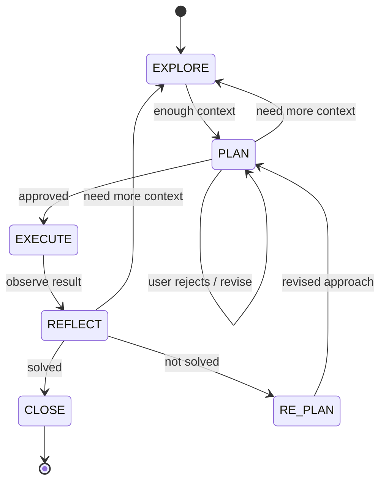

# Iterative Planner

[](LICENSE)
[](CHANGELOG.md)
[](https://www.electiconsulting.com)

**Complex tasks break AI agents. This skill fixes that.**

A [Claude Code](https://docs.anthropic.com/en/docs/claude-code) skill that enforces a rigorous state machine: **Explore → Plan → Execute → Reflect → Re-plan.** The filesystem becomes persistent working memory -- every decision, every failed approach, every discovery is written to disk. When the context window inevitably fills up, nothing is lost.

The problem it solves: Claude starts strong, plans once, then hits a wall. Instead of stepping back, it layers fixes on top of fixes, losing track of what it already tried. By the time context rot kicks in, it's forgotten what it was even doing. The result is worse than where it started.

Iterative Planner kills this pattern dead. Whether you're refactoring a codebase, researching a complex topic, designing a system, or working through any multi-step problem -- the planner keeps Claude structured, recoverable, and under your control.

---

## Get Started in 60 Seconds

**Option 1 -- Zip package (recommended)**
Download the latest zip from [Releases](https://github.com/NikolasMarkou/iterative-planner/releases) and unzip into your local skills directory:
```bash
unzip iterative-planner-v*.zip -d ~/.claude/skills/
```

**Option 2 -- Single file**
Download `iterative-planner-combined.md` from [Releases](https://github.com/NikolasMarkou/iterative-planner/releases) and add it to Claude Code's Custom Instructions (Settings → Custom Instructions).
> Note: The single-file version does not include `bootstrap.mjs`. Plan directories must be created manually. For full bootstrap support, use the zip package.

**Option 3 -- Clone the repo**
```bash
git clone https://github.com/NikolasMarkou/iterative-planner.git ~/.claude/skills/iterative-planner
```

Then give Claude a complex task -- or just say: **"plan this"**

---

## How It Works

Six states. Every transition logged. Every decision recorded. The filesystem is the source of truth, not the context window.


> Note: Mermaid uses `RE_PLAN` (underscore) because hyphens are not valid in state names. Everywhere else, `RE-PLAN` (hyphen) is used.

| State | What happens | Guardrails |
|-------|-------------|------------|
| **EXPLORE** | Read, search, ask questions, map the problem space. Pull in findings and decisions from previous plans. | Read-only. All notes go to the plan directory. |
| **PLAN** | Design the approach. Identify every artifact to create or modify. Set success criteria. | No changes yet. User must approve before execution. |
| **EXECUTE** | Implement one step at a time. Commit after each success. | 2 fix attempts max. Revert-first on failure. Surprises → REFLECT. |
| **REFLECT** | Compare results against written criteria. Validate findings. | Evidence-based only. Contradicted findings → back to EXPLORE. |
| **RE-PLAN** | Pivot based on what was learned. Log the decision. | Must explain what failed and why. User approves new direction. |
| **CLOSE** | Write summary. Audit decision anchors. Merge knowledge to consolidated files. | Verify clean output -- no leftover artifacts. |

---

## Why This Works

### Persistent Memory That Survives Context Rot

The #1 failure mode of AI agents on complex tasks is amnesia. Iterative Planner sidesteps it entirely -- everything important lives on disk.

```
plans/
├── .current_plan               # → active plan directory name
├── FINDINGS.md                 # Consolidated findings across all plans (newest first)
├── DECISIONS.md                # Consolidated decisions across all plans (newest first)
├── LESSONS.md                  # Cross-plan institutional memory (≤200 lines)
├── INDEX.md                    # Topic→directory mapping (survives sliding window trim)
└── plan_2026-02-14_a3f1b2c9/
    ├── state.md                # Current state, step, iteration
    ├── plan.md                 # The living plan (rewritten each iteration)
    ├── decisions.md            # Append-only log of every decision and pivot
    ├── findings.md             # Index of discoveries (corrected when wrong)
    ├── findings/               # Detailed research files
    ├── progress.md             # Done vs remaining
    ├── verification.md         # Verification results per REFLECT cycle
    ├── checkpoints/            # Snapshots before risky changes
    ├── lessons_snapshot.md     # LESSONS.md snapshot at close (auto-created)
    └── summary.md              # Written at close
```

State, decisions, findings, progress -- all recoverable, even if the conversation restarts from scratch.

### Cross-Plan Intelligence

When a plan closes, its findings and decisions merge into consolidated files at the `plans/` root. The next plan reads them during EXPLORE. This means:

- Migration plans **build on** analysis from previous debugging sessions
- Design plans **inherit constraints** discovered during earlier research
- Failed approaches are **visible to future plans** -- no repeating dead ends
- Corrected findings **carry forward** automatically

```markdown
# Consolidated Findings
*Cross-plan findings archive. Newest first.*

## plan_2026-02-20_b4e2c3d0
### Index
- [Database Schema](plan_2026-02-20_b4e2c3d0/findings/db-schema.md) — table relationships
### Key Constraints
- Foreign key constraints prevent cascade delete on users table

## plan_2026-02-19_a3f1b2c9
### Index
- [Auth System](plan_2026-02-19_a3f1b2c9/findings/auth-system.md) — entry points, session stores
### Key Constraints
- SessionSerializer shared between cookie middleware AND API auth
```

### Self-Correcting Research

Most AI agents treat research as throwaway context -- they gather information, form impressions, start executing. When the context window compresses, the impressions vanish.

Iterative Planner makes research a **first-class artifact**. Every discovery is written to `findings.md` with specific references and evidence. The agent can't transition to PLAN until it has at least 3 indexed findings covering problem scope, affected areas, and existing patterns.

When execution proves a finding wrong, it gets a `[CORRECTED iter-N]` marker. The original stays for traceability; the correction is what the agent acts on.

### The Autonomy Leash

When a step fails, the agent gets exactly **2 small fix attempts** -- each constrained to reverting, deleting, or a minimal change. If neither works, it **stops and asks you**. No silent rewrites. No runaway fix chains.

### Built-in Reasoning Frameworks

Each state embeds domain-agnostic thinking tools:

| Framework | State | What it does |
|-----------|-------|-------------|
| **Constraint classification** | EXPLORE | Tag every constraint as *hard*, *soft*, or *ghost* (no longer applies). Ghost constraints unlock options nobody thought existed. |
| **Exploration confidence** | EXPLORE → PLAN | Self-assess scope, solution space, risk visibility. "Shallow" on any = keep exploring. |
| **Problem decomposition** | PLAN | Understand the whole, find natural boundaries, minimize dependencies, start with the riskiest part. |
| **Assumption tracking** | PLAN | Every assumption traced to a finding, linked to dependent steps. When one breaks, you know what's invalidated. |
| **Pre-mortem & falsification** | PLAN | Assume the plan failed -- why? Extract concrete STOP IF triggers. Prevents confirmation bias. |
| **Prediction accuracy** | REFLECT | Compare predictions against actuals. Calibrates future estimates via LESSONS.md. |
| **Ghost constraint hunting** | RE-PLAN | Before pivoting, check if the constraint behind the failed approach is still valid. |
| **Essential vs accidental complexity** | REFLECT | "Inherent in the problem, or did we create it?" Essential = partition. Accidental = remove. |

### Revert-First Complexity Control

The default response to failure is to **simplify, never to add**:

1. Can I fix by **reverting**? Do that.
2. Can I fix by **deleting**? Do that.
3. **One-line** fix? Do that.
4. None of the above? **Stop.** Enter REFLECT.

Plus hard limits to keep things honest:

| Rule | What it does |
|------|-------------|
| **10-Line Rule** | If a "fix" needs more than 10 new lines, it's not a fix -- it needs a plan. |
| **3-Strike Rule** | Same area breaks 3 times? The approach is wrong. Mandatory RE-PLAN. |
| **Complexity Budget** | Max 3 new files, max 2 new abstractions, target net-zero or negative line count. |
| **Nuclear Option** | Iteration 5, scope doubled? Recommend full revert. Decision log preserves all learnings. |
| **6 Simplification Checks** | Structured diagnostic: delete instead? symptom or root cause? essential or accidental? fighting the framework? worth reverting everything? |

### Decision Anchoring

When code survives failed alternatives, the agent leaves a `# DECISION D-NNN` comment at the point of impact -- documenting what *not* to do and why. This prevents future sessions (or future developers) from "fixing" a deliberate choice back into a known-broken state.

```python
# DECISION D-003: Using stateless tokens instead of dual-write.
# Dual-write doubled Redis memory due to 30-day TTLs (see decisions.md D-002, D-003).
# Do NOT switch back to session-store-based approach without addressing memory growth.
def create_token(user):
    ...
```

### Clean Output Hygiene

Every change is tracked in a manifest. Failed steps revert immediately -- no half-applied changes, no leftover experiments, no abandoned artifacts. The workspace is always in a known-good state before any new work begins.

---

## When to Use This

| Use it | Skip it |
|--------|---------|
| Multi-step tasks touching 3+ files or systems | Single-file, single-step changes |
| Migrations, refactors, architectural changes | Well-known, straightforward solutions |
| Tasks that have already failed once | Quick fixes where you already know the answer |
| Complex research or analysis with many moving parts | |
| System design and technical decision-making | |
| Debugging sessions where the root cause is unclear | |
| Any problem where "just do it" leads to a mess | |

Trigger phrases: *"plan this"*, *"figure out"*, *"help me think through"*, *"I've been struggling with"*, *"debug this complex issue"*

---

## Bootstrapping

Manage plan directories from your project root:

```bash
node <skill-path>/scripts/bootstrap.mjs new "goal"           # Create new plan
node <skill-path>/scripts/bootstrap.mjs new --force "goal"   # Close active plan, create new one
node <skill-path>/scripts/bootstrap.mjs resume               # Output current plan state for re-entry
node <skill-path>/scripts/bootstrap.mjs status               # One-line state summary
node <skill-path>/scripts/bootstrap.mjs close                # Close active plan (merges + preserves)
node <skill-path>/scripts/bootstrap.mjs list                 # Show all plan directories
node <skill-path>/scripts/validate-plan.mjs                  # Validate active plan compliance
```

**`new`** creates the plan directory under `plans/`, writes the pointer file, creates consolidated files if they don't exist, and drops the agent into EXPLORE. Refuses if an active plan already exists -- use `resume` to continue, `close` to end it, or `new --force` to close and start fresh.

**`close`** merges per-plan findings and decisions into the consolidated files (newest first), appends to the topic index (`INDEX.md`), snapshots `LESSONS.md` to the plan directory, removes the pointer, and preserves the plan directory for reference.

**`resume`** outputs the current plan state for quick re-entry. **`status`** prints a single-line summary. **`list`** shows all plan directories with their state and goal.

### Git Integration

| Phase | Git behavior |
|-------|-------------|
| EXPLORE, PLAN, REFLECT, RE-PLAN | No commits. |
| EXECUTE (success) | Commit after each step: `[iter-N/step-M] description` |
| EXECUTE (failure) | Revert all uncommitted changes to last clean commit. |
| RE-PLAN | Decide: keep successful commits or revert to checkpoint. |
| CLOSE | Final commit with summary. |

Bootstrap automatically adds `plans/` to `.gitignore`. Remove this if your team wants decision logs for post-mortems.

### Merge Edge Cases (Consolidated Files)

When `bootstrap.mjs close` merges per-plan files into `plans/FINDINGS.md` and `plans/DECISIONS.md`:

- Only content at and below the first `##` heading is merged from per-plan files.
- If a per-plan file has no `##` headings, it is treated as non-mergeable boilerplate and skipped.
- Cross-plan boilerplate notes are stripped before merge to avoid duplicated metadata in consolidated files.
- Relative links like `(findings/foo.md)` are rewritten to include the plan directory path.

---

## Contributing

### Build and Package

```bash
# Windows (PowerShell)
.\build.ps1 package          # Create zip package
.\build.ps1 package-combined # Create single-file skill
.\build.ps1 validate         # Validate structure
.\build.ps1 test             # Run tests (lint + round-trip)
.\build.ps1 clean            # Clean build artifacts

# Unix / Linux / macOS
make package                 # Create zip package
make package-combined        # Create single-file skill
make validate                # Validate structure
make test                    # Run tests (lint + round-trip)
make clean                   # Clean build artifacts
```

### Project Structure

```
iterative-planner/
├── README.md                 # This file
├── CLAUDE.md                 # AI assistant guidance for contributing
├── CHANGELOG.md              # Version history
├── LESSONS.md                # Cross-plan lessons learned from using the planner on itself
├── LICENSE                   # GNU GPLv3
├── VERSION                   # Single source of truth for version number
├── Makefile                  # Unix/Linux/macOS build
├── build.ps1                 # Windows PowerShell build
└── src/
    ├── SKILL.md              # Core protocol -- the complete skill specification
    ├── scripts/
    │   ├── bootstrap.mjs     # Plan directory initializer (Node.js 18+)
    │   ├── bootstrap.test.mjs # Test suite (node:test, 97 tests)
    │   └── validate-plan.mjs  # Protocol compliance validator (Node.js 18+)
    └── references/
        ├── complexity-control.md   # Anti-complexity protocol and forbidden patterns
        ├── code-hygiene.md         # Change manifests, revert procedures, cleanup rules
        ├── decision-anchoring.md   # When and how to anchor decisions in code
        ├── file-formats.md         # Templates for every plan directory file
        └── planning-rigor.md       # Assumptions, pre-mortem, falsification, prediction accuracy
```

---

## Sponsored by

This project is sponsored by **[Electi Consulting](https://www.electiconsulting.com)** -- a technology consultancy specializing in AI, blockchain, cryptography, and data science. Founded in 2017 and headquartered in Limassol, Cyprus, with a London presence, Electi combines academic rigor with enterprise-grade delivery across clients including the European Central Bank, US Navy, and Cyprus Securities and Exchange Commission.

---

## License

[GNU General Public License v3.0](LICENSE)
