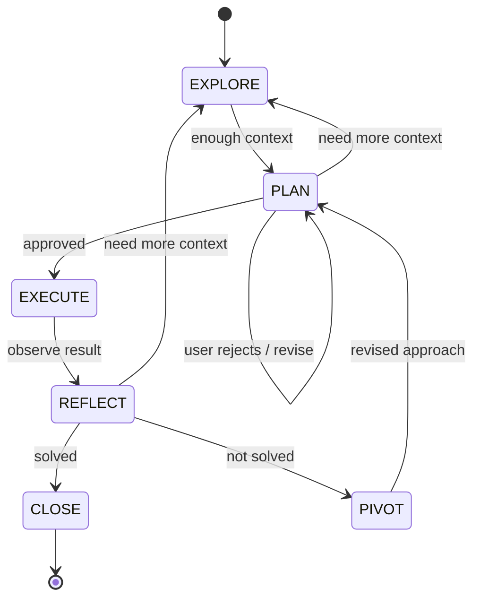

# Iterative Planner

[](LICENSE)
[](CHANGELOG.md)
[](https://www.electiconsulting.com)

Without structure, Claude plans once, hits a wall, and layers fixes on fixes until it loses track of what it already tried. Iterative Planner prevents this by forcing structured iteration: a [Claude Code](https://docs.anthropic.com/en/docs/claude-code) skill that enforces a state machine -- **Explore, Plan, Execute, Reflect, Pivot**. The filesystem is persistent working memory. Decisions, failed approaches, and discoveries are written to disk and survive context window compression.

Works for refactoring, research, system design, or any multi-step problem.

---

## When to Use This

| Use it | Skip it |
|--------|---------|
| Multi-step tasks touching 3+ files or systems | Single-file, single-step changes |
| Migrations, refactors, architectural changes | Well-known, straightforward solutions |
| Tasks that have already failed once | Quick fixes where you already know the answer |
| Complex research or analysis with many moving parts | |
| System design and technical decision-making | |
| Debugging sessions where the root cause is unclear | |
| Any problem where "just do it" leads to a mess | |

Trigger phrases: *"plan this"*, *"figure out"*, *"help me think through"*, *"I've been struggling with"*, *"debug this complex issue"*

---

## Get Started in 60 Seconds

**Requires**: Node.js 18+ (for bootstrap script)

**Option 1: Zip package (recommended)**
Download the latest zip from [Releases](https://github.com/NikolasMarkou/iterative-planner/releases) and unzip into your local skills directory:
```bash
unzip iterative-planner-v*.zip -d ~/.claude/skills/
```

**Option 2: Single file**
Download `iterative-planner-combined.md` from [Releases](https://github.com/NikolasMarkou/iterative-planner/releases) and add it to Claude Code's Custom Instructions (Settings > Custom Instructions).
> Note: The single-file version does not include `bootstrap.mjs`. Plan directories must be created manually. For full bootstrap support, use the zip package.

**Option 3: Clone the repo**
```bash
git clone https://github.com/NikolasMarkou/iterative-planner.git ~/.claude/skills/iterative-planner
```

Then give Claude a complex task, or just say: **"plan this"**

---

## How It Works

Six states (plus an implicit START). Every transition logged. Every decision recorded. The filesystem is the source of truth, not the context window.



> Note: The mermaid diagram above renders on GitHub. If your viewer does not support mermaid, see the state table below.

| State | What happens | Guardrails |
|-------|-------------|------------|
| **EXPLORE** | Read, search, ask questions, map the problem space. Pull in findings and decisions from previous plans. | Read-only. All notes go to the plan directory. |
| **PLAN** | Design the approach. Identify every artifact to create or modify. Set success criteria. | No changes yet. User must approve before execution. |
| **EXECUTE** | Implement one step at a time. Commit after each success. | 2 fix attempts max. Revert-first on failure. Surprises trigger REFLECT. |
| **REFLECT** | 3-phase evaluation: Gate-In (read all context), Evaluate (verify, diff review, regression check, scope drift, root cause analysis, run `validate-plan.mjs`), Gate-Out (write results, present to user). | Evidence-based only. Regressions and simplification blockers prevent CLOSE. Contradicted findings trigger EXPLORE. |
| **PIVOT** | Change direction based on what was learned. Log the decision. | Must explain what failed and why. User approves new direction. |
| **CLOSE** | Write summary. Audit decision anchors. Merge knowledge to consolidated files. | Verify clean output, no leftover artifacts. |

### Iteration Limits

Iterations increment on each PLAN to EXECUTE transition. The protocol enforces hard limits:

- **Iteration 5**: Mandatory decomposition analysis -- identify 2-3 independent sub-goals that could each be a separate plan.
- **Iteration 6+**: Hard stop. The decomposition analysis is presented to the user. The task must be broken into smaller plans.

---

## Why This Works

### Persistent Memory

Everything important lives on disk, not the context window.

```
plans/
+-- .current_plan               # active plan directory name
+-- FINDINGS.md                 # Consolidated findings across all plans (newest first)
+-- DECISIONS.md                # Consolidated decisions across all plans (newest first)
+-- LESSONS.md                  # Cross-plan institutional memory (max 200 lines)
+-- INDEX.md                    # Topic-to-directory mapping (survives sliding window trim)
+-- plan_2026-02-14_a3f1b2c9/
    +-- state.md                # Current state, step, iteration
    +-- plan.md                 # The living plan (rewritten each iteration)
    +-- decisions.md            # Append-only log of every decision and pivot
    +-- findings.md             # Index of discoveries (corrected when wrong)
    +-- findings/               # Detailed research files
    +-- progress.md             # Done vs remaining
    +-- verification.md         # Verification results per REFLECT cycle
    +-- checkpoints/            # Snapshots before risky changes
    +-- lessons_snapshot.md     # LESSONS.md snapshot at close (auto-created)
    +-- summary.md              # Written at close
```

State, decisions, findings, and progress are recoverable across conversation restarts.

**Mandatory re-reads** keep the agent grounded: `state.md` is re-read every 10 tool calls, and after 50 messages the agent re-reads `state.md` + `plan.md` before every response. The filesystem is truth, not memory.

### Cross-Plan Intelligence

When a plan closes, its findings and decisions merge into consolidated files at the `plans/` root. The next plan reads them during EXPLORE. This means:

- Migration plans **build on** analysis from previous debugging sessions
- Design plans **inherit constraints** discovered during earlier research
- Failed approaches are **visible to future plans**, preventing repeated dead ends
- Corrected findings **carry forward** automatically

Consolidated files are naturally bounded by a **sliding window**: bootstrap trims them to the 8 most recent plan sections on each close. Older plan sections are removed from the consolidated file but remain intact in their per-plan directories. If a file still exceeds 500 lines, a compressed summary is generated. This keeps cross-plan context useful without blowing up the context window.

```markdown
# Consolidated Findings
*Cross-plan findings archive. Newest first.*

## plan_2026-02-20_b4e2c3d0
### Index
- [Database Schema](plan_2026-02-20_b4e2c3d0/findings/db-schema.md): table relationships
### Key Constraints
- Foreign key constraints prevent cascade delete on users table

## plan_2026-02-19_a3f1b2c9
### Index
- [Auth System](plan_2026-02-19_a3f1b2c9/findings/auth-system.md): entry points, session stores
### Key Constraints
- SessionSerializer shared between cookie middleware AND API auth
```

### Self-Correcting Research

Every discovery is written to `findings.md` with references and evidence. The agent can't transition to PLAN until it has at least 3 indexed findings covering problem scope, affected areas, and existing patterns.

When execution proves a finding wrong, it gets a `[CORRECTED iter-N]` marker. The original stays for traceability.

### The Autonomy Leash

When a step fails, the agent gets 2 fix attempts, each constrained to reverting, deleting, or a minimal change. If neither works, it stops and asks you.

### Built-in Reasoning Frameworks

Each state embeds domain-agnostic thinking tools, grouped by phase:

**Exploration**

| Framework | What it does |
|-----------|-------------|
| **Constraint classification** | Tag every constraint as *hard*, *soft*, or *ghost* (no longer applies). Ghost constraints reveal previously blocked options. |
| **Exploration confidence** | Self-assess scope, solution space, risk visibility. "Shallow" on any dimension means keep exploring. |

**Planning**

| Framework | What it does |
|-----------|-------------|
| **Problem decomposition** | Understand the whole, find natural boundaries, minimize dependencies, start with the riskiest part. |
| **Assumption tracking** | Every assumption traced to a finding, linked to dependent steps. When one breaks, you know what's invalidated. |
| **Pre-mortem and falsification** | Assume the plan failed. Why? Extract concrete STOP IF triggers. Prevents confirmation bias. |

**Reflection and Pivot**

| Framework | What it does |
|-----------|-------------|
| **Prediction accuracy** | Compare predictions against actuals. Calibrates future estimates via LESSONS.md. |
| **Root cause analysis** | On failure: immediate cause, contributing factor, prevention. Structured 3-question technique. |
| **Essential vs accidental complexity** | "Inherent in the problem, or did we create it?" Essential = partition. Accidental = remove. |
| **Ghost constraint hunting** | Before pivoting, check if the constraint behind the failed approach is still valid. |

### Revert-First Complexity Control

The default response to failure is to **simplify, never to add**:

1. Can I fix by **reverting**? Do that.
2. Can I fix by **deleting**? Do that.
3. **One-line** fix? Do that.
4. None of the above? **Stop.** Enter REFLECT.

Hard limits:

| Rule | What it does |
|------|-------------|
| **10-Line Rule** | If a "fix" needs more than 10 new lines, it's not a fix. It needs a plan. |
| **3-Strike Rule** | Same area breaks 3 times? The approach is wrong. Mandatory PIVOT. |
| **Complexity Budget** | Max 3 new files, max 2 new abstractions, target net-zero or negative line count. |
| **Nuclear Option** | Iteration 5, scope doubled? Recommend full revert. Decision log preserves all learnings. |
| **6 Simplification Checks** | Structured diagnostic: delete instead? symptom or root cause? essential or accidental? fighting the framework? worth reverting everything? |

### Decision Anchoring

When code survives failed alternatives, the agent leaves a `# DECISION D-NNN` comment at the point of impact, documenting what *not* to do and why. This prevents future sessions (or future developers) from "fixing" a deliberate choice back into a known-broken state.

```python
# DECISION D-003: Using stateless tokens instead of dual-write.
# Dual-write doubled Redis memory due to 30-day TTLs (see decisions.md D-002, D-003).
# Do NOT switch back to session-store-based approach without addressing memory growth.
def create_token(user):
    ...
```

### Clean Output Hygiene

Every change is tracked in a manifest. Failed steps revert immediately. The workspace is always in a known-good state before new work begins.

---

## Bootstrapping

Manage plan directories from your project root:

```bash
node <skill-path>/scripts/bootstrap.mjs new "goal"           # Create new plan
node <skill-path>/scripts/bootstrap.mjs new --force "goal"   # Close active plan, create new one
node <skill-path>/scripts/bootstrap.mjs resume               # Output current plan state for re-entry
node <skill-path>/scripts/bootstrap.mjs status               # One-line state summary
node <skill-path>/scripts/bootstrap.mjs close                # Close active plan (merges + preserves)
node <skill-path>/scripts/bootstrap.mjs list                 # Show all plan directories
node <skill-path>/scripts/validate-plan.mjs                  # Validate active plan compliance
```

**`new`** creates the plan directory under `plans/`, writes the pointer file, creates consolidated files if they don't exist, and drops the agent into EXPLORE. Refuses if an active plan already exists. Use `resume` to continue, `close` to end it, or `new --force` to close and start fresh.

**`close`** merges per-plan findings and decisions into the consolidated files (newest first), appends to the topic index (`INDEX.md`), snapshots `LESSONS.md` to the plan directory, removes the pointer, and preserves the plan directory for reference.

**`resume`** outputs the current plan state for quick re-entry. This is the key command for surviving context window resets. Use it at the start of a new conversation, after context compression, or any time the agent seems to have lost track. It reads `state.md`, `plan.md`, `progress.md`, and `decisions.md` from the active plan and prints a structured summary of where things stand: current state, iteration, step, what's done, what's next.

**`status`** prints a single-line summary. **`list`** shows all plan directories with their state and goal.

**`validate-plan.mjs`** checks protocol compliance of the active plan. It runs automatically during REFLECT (step 16 in the protocol) and flags structural issues (missing files, invalid state, empty required sections) as ERRORs or WARNs.

### Git Integration

| Phase | Git behavior |
|-------|-------------|
| EXPLORE, PLAN, REFLECT, PIVOT | No commits. |
| EXECUTE (success) | Commit after each step: `[iter-N/step-M] description` |
| EXECUTE (failure) | Revert all uncommitted changes to last clean commit. |
| PIVOT | Decide: keep successful commits or revert to checkpoint. |
| CLOSE | Final commit with summary. |

Bootstrap automatically adds `plans/` to `.gitignore`. Remove this if your team wants decision logs for post-mortems.

### Merge Edge Cases (Consolidated Files)

When `bootstrap.mjs close` merges per-plan files into `plans/FINDINGS.md` and `plans/DECISIONS.md`:

- Only content at and below the first `##` heading is merged from per-plan files.
- If a per-plan file has no `##` headings, it is treated as non-mergeable boilerplate and skipped.
- Cross-plan boilerplate notes are stripped before merge to avoid duplicated metadata in consolidated files.
- Relative links like `(findings/foo.md)` are rewritten to include the plan directory path.

---

## FAQ

**What if bootstrap refuses to create a new plan?**
An active plan already exists. Use `resume` to continue it, `close` to end it, or `new --force` to close it and start fresh.

**Can I have multiple active plans at once?**
No. One active plan at a time, tracked by `plans/.current_plan`. Close the current plan before starting a new one.

**Where do plan files go?**
Always under `plans/` in the project root. Bootstrap creates this directory automatically.

**Are plan files committed to git?**
No. Bootstrap adds `plans/` to `.gitignore` by default. Remove that entry if you want decision logs versioned.

**What if I want to start completely over?**
Run `bootstrap.mjs new --force "new goal"`. This closes the active plan (merging its findings) and creates a fresh one. All previous plan directories are preserved.

**What happens at iteration 5?**
The protocol forces a decomposition analysis: identify 2-3 independent sub-goals that could each be a separate plan. At iteration 6+, execution stops entirely and the decomposition is presented so the task can be broken up.

---

## Contributing

### Running Tests

The test suite covers bootstrap operations, state transitions, consolidated file management, and edge cases:

```bash
node --test src/scripts/bootstrap.test.mjs    # 102 tests
```

### Build and Package

```bash
# Windows (PowerShell)
.\build.ps1 package          # Create zip package
.\build.ps1 package-combined # Create single-file skill
.\build.ps1 validate         # Validate structure
.\build.ps1 test             # Run tests (lint + round-trip)
.\build.ps1 clean            # Clean build artifacts

# Unix / Linux / macOS
make package                 # Create zip package
make package-combined        # Create single-file skill
make validate                # Validate structure
make test                    # Run tests (lint + round-trip)
make clean                   # Clean build artifacts
```

### Validation Checklist

Before submitting changes:

- [ ] `.\build.ps1 validate` (or `make validate`) passes
- [ ] `node --test src/scripts/bootstrap.test.mjs` passes
- [ ] `src/SKILL.md` has `name:` and `description:` in YAML frontmatter
- [ ] All cross-references in `src/SKILL.md` point to existing files in `src/references/`
- [ ] State machine diagram matches transition rules table
- [ ] Plan directory structure in `src/SKILL.md` matches `bootstrap.mjs` output

### Project Structure

```
iterative-planner/
+-- README.md                 # This file
+-- CLAUDE.md                 # AI assistant guidance for contributing
+-- CHANGELOG.md              # Version history
+-- LICENSE                   # GNU GPLv3
+-- VERSION                   # Single source of truth for version number
+-- Makefile                  # Unix/Linux/macOS build
+-- build.ps1                 # Windows PowerShell build
+-- src/
    +-- SKILL.md              # Core protocol (the complete skill specification)
    +-- scripts/
    |   +-- bootstrap.mjs     # Plan directory initializer (Node.js 18+)
    |   +-- bootstrap.test.mjs # Test suite (node:test, 102 tests)
    |   +-- validate-plan.mjs  # Protocol compliance validator (Node.js 18+)
    +-- references/
        +-- code-hygiene.md         # Change manifests, revert procedures, cleanup rules
        +-- complexity-control.md   # Anti-complexity protocol and forbidden patterns
        +-- convergence-metrics.md  # Convergence score, momentum tracker, iteration health signals
        +-- decision-anchoring.md   # When and how to anchor decisions in code
        +-- file-formats.md         # Templates for every plan directory file
        +-- planning-rigor.md       # Assumptions, pre-mortem, falsification, prediction accuracy, root cause analysis
```

For the complete protocol specification, see [`src/SKILL.md`](src/SKILL.md).

---

## Sponsored by

This project is sponsored by **[Electi Consulting](https://www.electiconsulting.com)**, a technology consultancy specializing in AI, blockchain, cryptography, and data science. Founded in 2017 and headquartered in Limassol, Cyprus, with a London presence. Clients include the European Central Bank, US Navy, and Cyprus Securities and Exchange Commission.

---

## License

[GNU General Public License v3.0](LICENSE)
